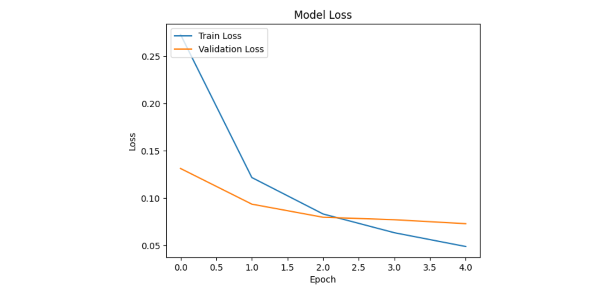

# Handwritten Digit Recognition


## Project Description

This project is a handwritten digit recognition model using a neural network. The model was trained with the MNIST dataset, which contains 60,000 images for training and 10,000 images for testing, each with a corresponding label (0 to 9) indicating the digit represented. The images are 28x28 grayscale pixel matrices, normalized to have values between 0 and 1.

## Project Structure

```plaintext
Digit recognition
│
├── Dataset
│   └── MNIST
│
├── Neural network
│   └── 100,618 neurons
│
└── Accuracy [ 98% ]
```

## Architecture

The digit-recognition.ipynb file contains all the code necessary to train and evaluate the handwritten digit recognition model.

- **Dataset Loading:** The Keras MNIST dataset is loaded and the pixel values ​​are normalized.
- **Image Viewing:** Some of the training images are displayed with their corresponding labels.
- **Model Construction:** A sequential neural network is built with an input layer, a hidden layer and an output layer.
- **Model Compilation:** The model is compiled using the Adam optimizer and the categorical cross entropy loss function.
- **Model Training:** The model is trained with the training data and validated with a fraction of the data.
- **Model Evaluation:** The model is evaluated using the test data and the accuracy results are shown.
- **Predictions:** Predictions are made on the test data and some of them are displayed.

## Learning curve

The learning curve of an artificial intelligence model is the curve in which it has fewer errors each time


